

# 🎵 YumeTunes
**Your Personal Anime Music Sanctuary**

*Listen to iconic OSTs, sync lyrics, and vibe with the community.* 
**[Explore the Live App](https://yumetunes.duckdns.org)**

 

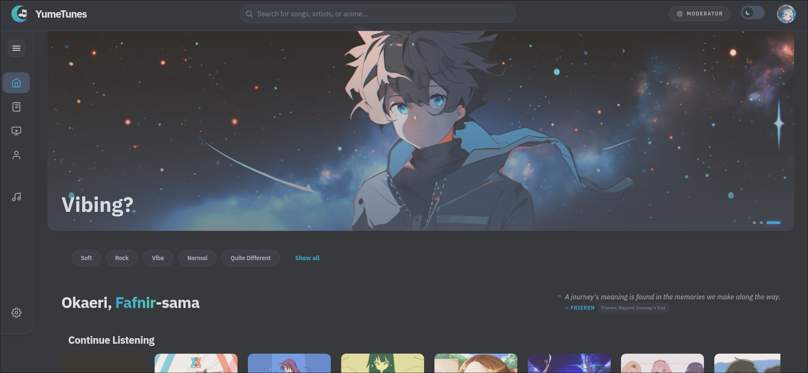

---

## ✨ Features & Architecture

YumeTunes is a highly modular, responsive, full-stack PERN application designed with performance, UX, and robust DevOps practices in mind.

### 🤖 Telemetry & Smart Discovery
YumeTunes doesn't just play music; it learns what you love.
* **Intelligent Recommendations:** A Node.js backend engine analyzes user telemetry (listening history, skip rates, and playback duration) to serve highly customized daily recommendations.
* **Continue Listening:** Instantly pick up where you left off with a dynamically generated feed based on your most recent active sessions.

  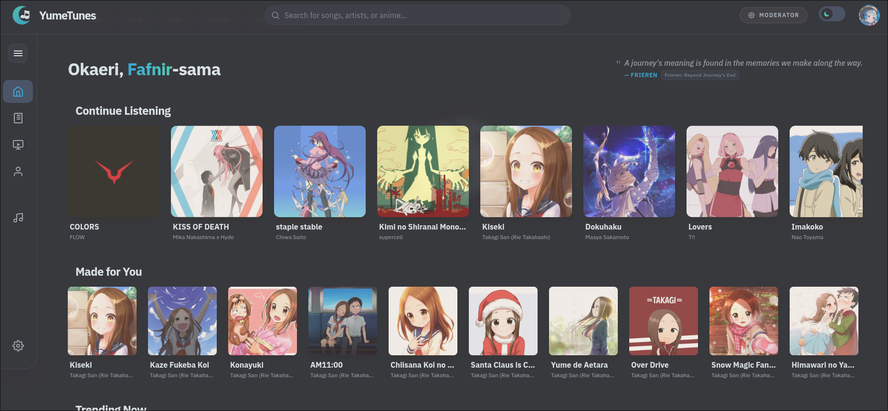

### 🎧 The Playback Engine
* **Modular Audio System:** Three distinct player views powered by a global React Playback Context (Utility Player, Bottom Player, and Fullscreen Theater Mode).
* **True Shuffle:** Custom implementation of the **Fisher-Yates algorithm** for completely unbiased, mathematical queue shuffling.
* **Optimized Rendering:** Built using heavily memoized React Hooks and Contexts to prevent audio stuttering and unnecessary DOM re-renders during playback.

  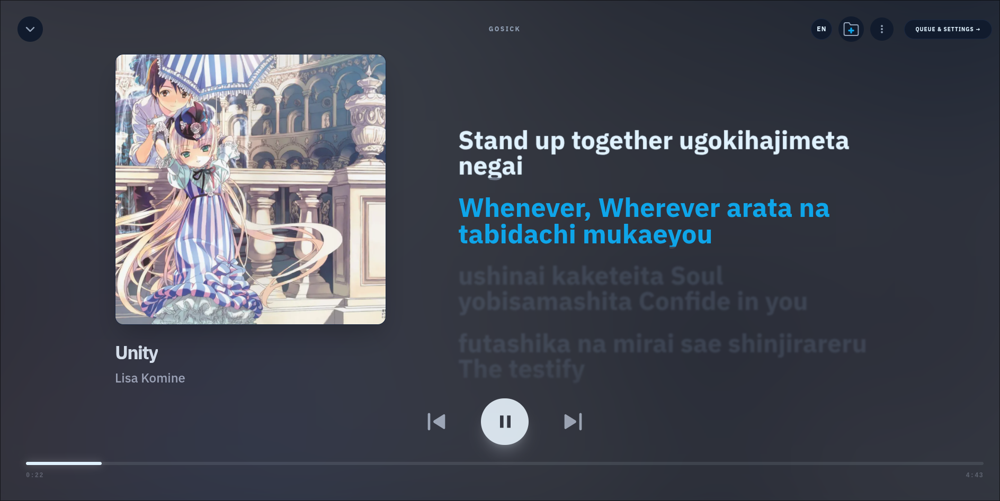
  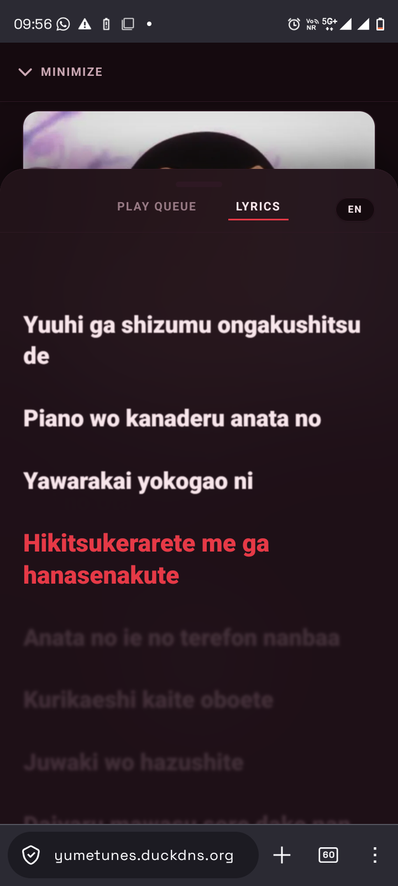

### 🎨 Dynamic UI & Personalization
* **Mobile-First Responsive Design:** Flawlessly scales across desktop, tablet, and mobile devices with dedicated bottom navigation and responsive modals.
* **Multi-Theme Engine:** 10+ dynamically injected themes featuring 5 premium color palettes, each with meticulously mapped Light and Dark mode variants, managed via a global `ThemeContext` and CSS variables.
* **Interactive Library:** Curate Liked Songs, manage custom Playlists, and view your complete chronological Listening History.
* **Smart Image Cropping:** Users can upload custom Profile Pictures and Banners using an integrated React Cropper, directly piped into **Cloudinary** for on-the-fly edge CDN compression.

  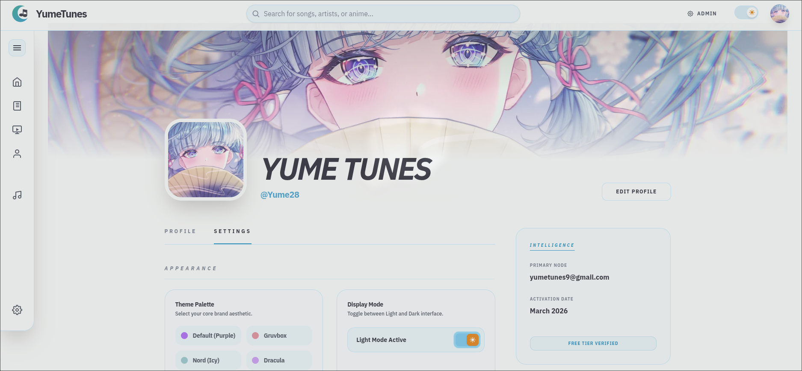
  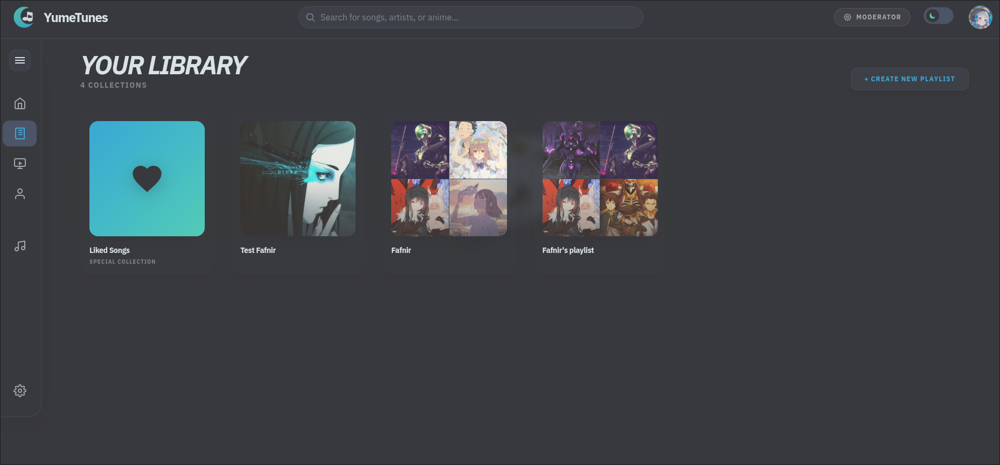

 

  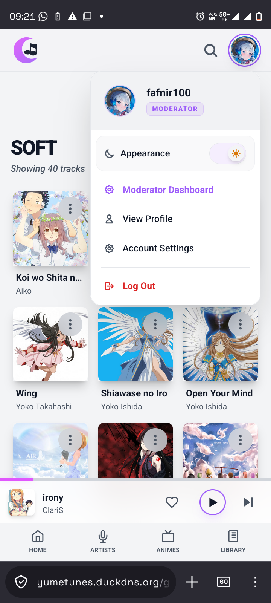
  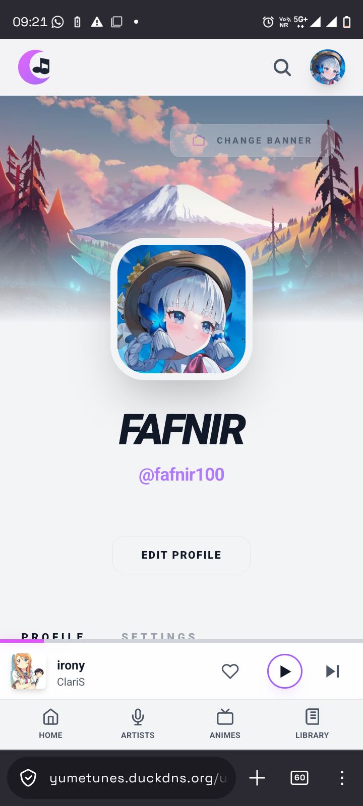
  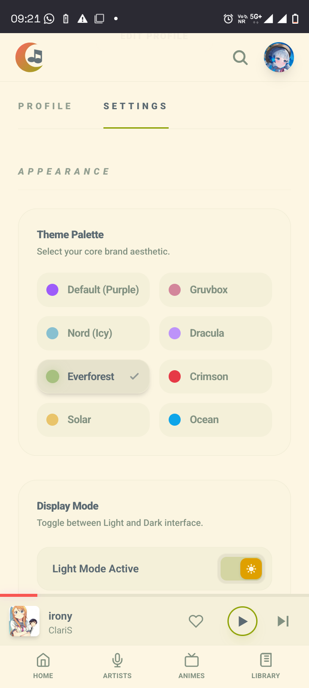

### 🛡️ Enterprise-Grade Security & Auth
* **Dual-Token Architecture:** Highly secure JWT authentication utilizing short-lived Access Tokens alongside long-lived, HttpOnly Refresh Tokens.
* **Silent Token Rotation:** Global Axios Interceptors automatically catch 401 Unauthorized errors, request a new access token in the background, and retry the failed request without interrupting the user's session.
* **Role-Based Access Control (RBAC):** Strict middleware protecting administrative routes, with granular read/write/delete permissions separated across `User`, `Moderator`, and `Admin` tiers.

### ⚙️ Content Management System (CMS)
* **Catalog Management:** Dedicated interfaces to manage the complex relational database of Artists, Animes, and Songs. Fully functional on both desktop and mobile.
* **Timed Lyrics Editor:** A specialized admin tool to perfectly sync `.lrc` formatted lyrics to audio timestamps.

  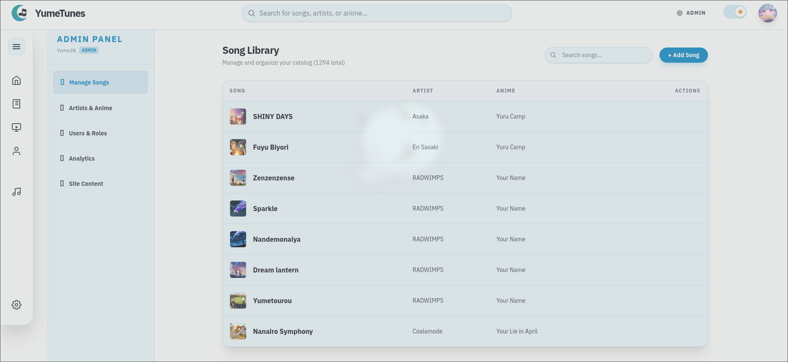
  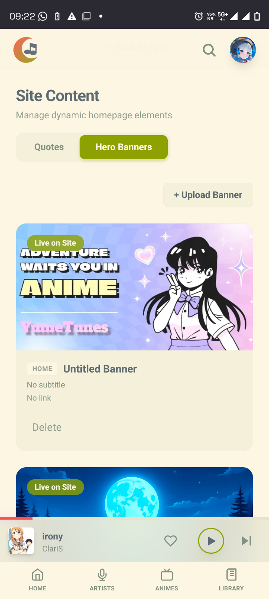

 

  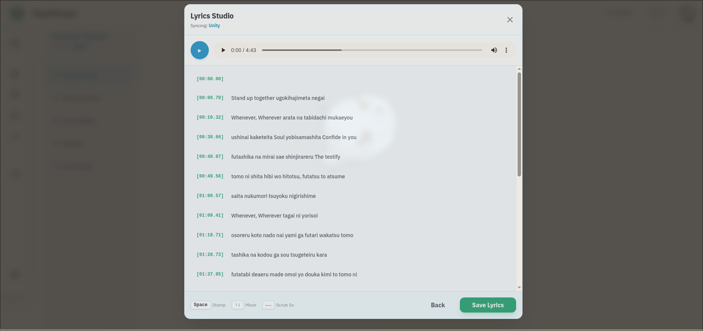
  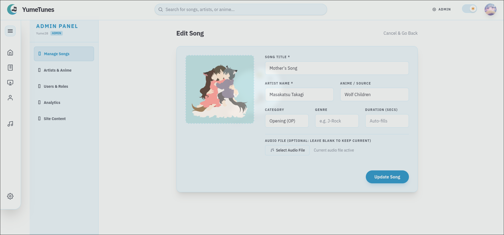

### 📊 Admin Analytics
A comprehensive data visualization suite giving server administrators a bird's-eye view of platform health, user registration velocity, and global listening telemetry.

  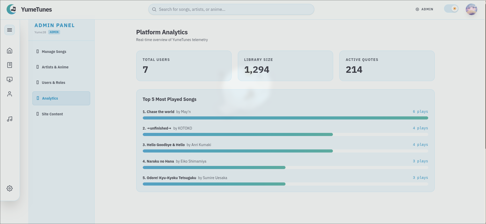

---

## 🛠️ Technology Stack

| Category | Technologies |
|---|---|
| **Frontend** | React, Vite, Tailwind CSS, Context API |
| **Backend** | Node.js, Express.js, RESTful APIs |
| **Database** | PostgreSQL |
| **Network/API** | Axios (Global Interceptors for Auth/Token Refresh) |
| **Media Hosting** | Cloudinary CDN (On-the-fly WebP optimization) |
| **DevOps & Cloud** | Docker (Alpine), AWS EC2, Nginx, DuckDNS, GitHub Actions |
| **Security** | Let's Encrypt (Certbot HTTPS), CORS, JWT Dual-Token |

---

## 🚀 DevOps & CI/CD Pipeline

The infrastructure of YumeTunes is built for production, heavily utilizing Docker and automated workflows to ensure zero-downtime deployments on an AWS Free Tier instance.

1. **Dockerized Environment:** The entire application runs on ultra-lightweight **Alpine Linux Docker images**, orchestrated via `docker-compose.yml`.
2. **Nginx Reverse Proxy:** Nginx acts as the gatekeeper, automatically routing API requests to the Node backend while efficiently caching and serving assets.
3. **Automated CI/CD:** Powered by **GitHub Actions**. Every push to the `main` branch triggers an automated sequence that connects to the AWS EC2 instance via SSH keys, pulls the latest code, and rebuilds the Docker containers.
4. **Memory Management:** Configured with Linux Swap Files to ensure stable builds on low-memory cloud instances without locking up the server.

---

  <b>Built with ♥ for Anime Fans</b> 
  Designed and developed by Staggered95

